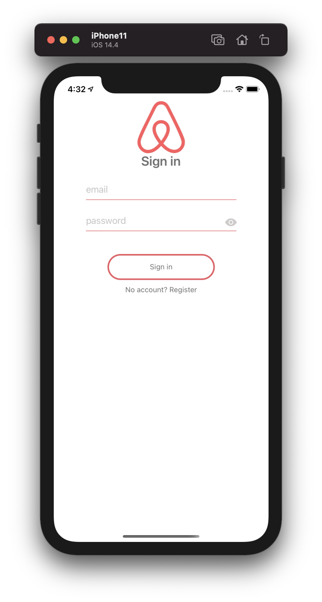
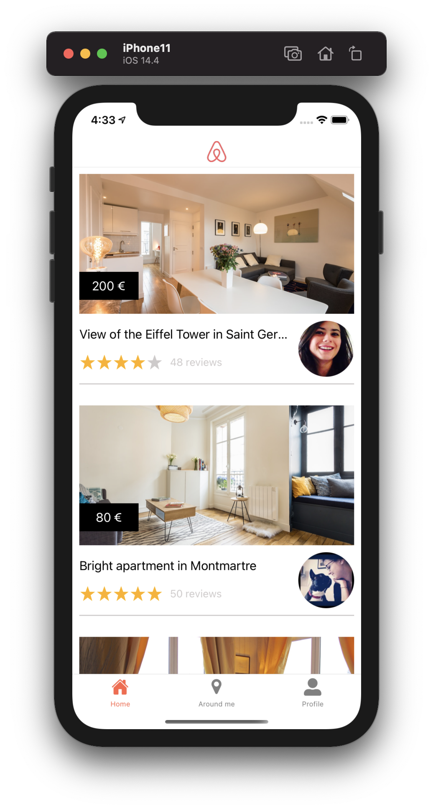
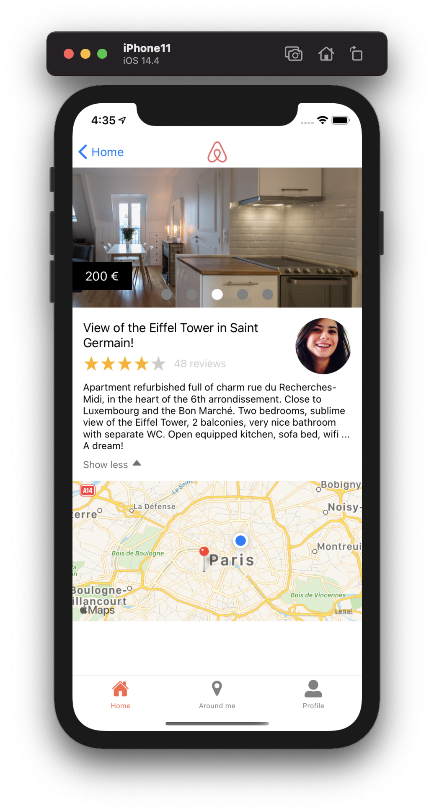
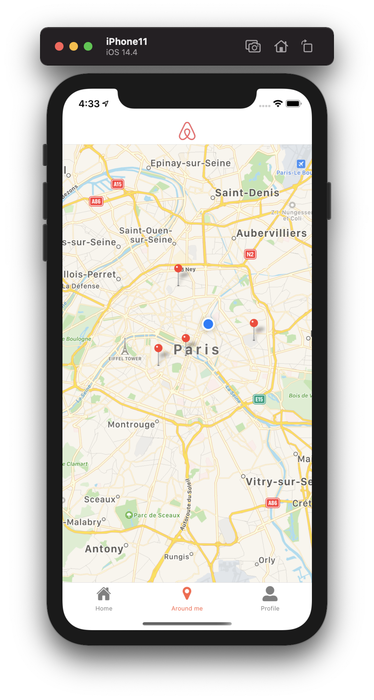

<h1 align="center">
	Airbnb Clone - React Native
</h1>

<p align="center">
	
</p>

## Overview

**Airbnb Clone made at [Le Reacteur](https://www.lereacteur.io/) Bootcamp.**  
6 screens are availables : Login, Signup, Home, Room, Around Me and Profile.

## Screenshots

<div align="center">




</div>

## Packages

-   [Async Storage](https://reactnative.dev/docs/asyncstorage)
-   [Axios](https://github.com/axios/axios)
-   [Expo](https://expo.io/)
-   [KeyboardAwareScrollView](https://github.com/APSL/react-native-keyboard-aware-scroll-view)
-   [Lottie React Native](https://github.com/lottie-react-native/lottie-react-native)
-   [React Native Maps](https://github.com/react-native-community/react-native-maps)
-   [React Native Swiper Flatlist](https://www.npmjs.com/package/react-native-swiper-flatlist)
-   [React Navigation](https://reactnavigation.org/)

## Installation and usage

Be sure, you have installed all dependencies and applications to run React Native Expo project on your computer : [Getting Started with React Native](https://facebook.github.io/react-native/docs/getting-started).

This project is adapted for iOS and Android.

### Running the project

Clone this repository :

```
git clone https://github.com/csengmany/airbnb-react-native.git
cd airbnb-react-native
```

Install packages :

```
npm install
```

or

```
yarn
```

When installation is complete :

```bash
expo start
```
